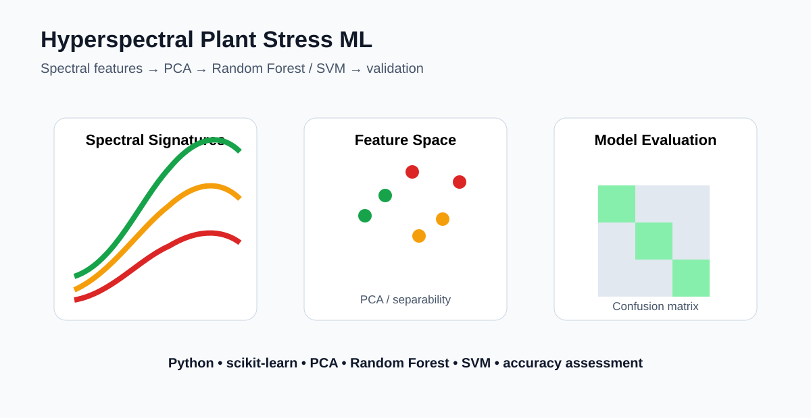

# Hyperspectral Plant Stress Classification with Machine Learning



A compact machine-learning workflow for distinguishing healthy vegetation, nutrient stress, and disease-like spectral responses from hyperspectral reflectance features.

## Portfolio value
This repository demonstrates how plant spectroscopy can be converted into ML-ready features and evaluated with multiple classifiers.

## Workflow
1. Generate/load reflectance spectra
2. Normalize spectra
3. Extract targeted VIS, red-edge and NIR features
4. Calculate NDVI-like and NDRE705 features
5. Explore separability with PCA
6. Train Random Forest and SVM classifiers
7. Evaluate model performance with a confusion matrix

## Spectral focus
Key wavelengths include 550, 670, 705, 740 and 800 nm, representing visible pigment response, red absorption, red-edge behavior, and near-infrared vegetation structure.

## Run
```bash
pip install -r requirements.txt
python src/demo.py
pytest -q
```

## Important data note
The included workflow generates **synthetic demonstration data**. It is designed to showcase an analytical workflow, not to represent measured disease or nutrient diagnoses.

## Extensions
The same pipeline can be connected to field spectrometer, UAV hyperspectral, or satellite-derived spectral datasets and expanded with cross-validation, explainable AI, wavelength selection, and external validation.

## Author
Priyanka Belbase | Hyperspectral Remote Sensing | Plant Stress | Machine Learning
