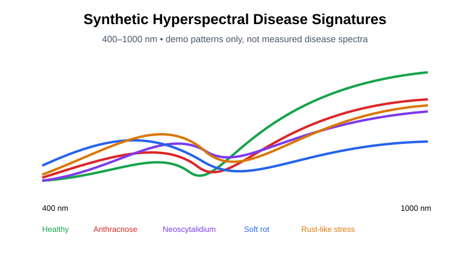
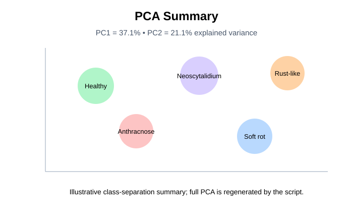
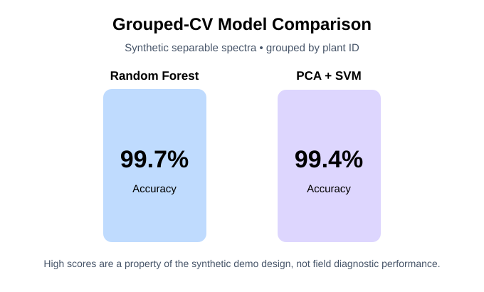
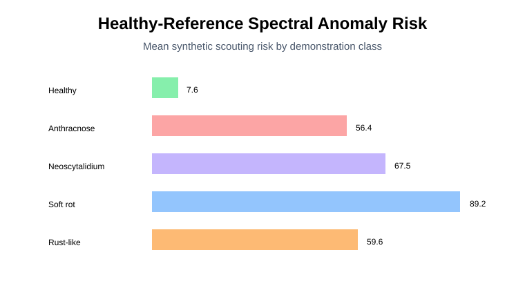
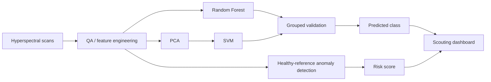

# AI Dragon Fruit Disease Scouting & Risk Dashboard

**Hyperspectral ML • PCA • Random Forest • SVM • anomaly detection • operational decision support**

**Timeline:** Doctoral research context **2023–2026** • Public GitHub portfolio implementation **2026**

This repository turns spectral classification into an end-to-end **scouting-priority workflow**: spectra → preprocessing/features → grouped ML validation → anomaly scoring → risk score → dashboard.

> **Transparency:** the public spectra are synthetic demonstration data generated by code. They are not unpublished research measurements and the outputs are not plant-disease diagnoses.

## Recruiter summary

- Synthetic hyperspectral signatures from **400–1000 nm**
- five demonstration plant-health classes
- repeated scans grouped by plant ID
- Random Forest vs PCA+SVM comparison
- **GroupKFold by plant** to reduce replicate leakage
- PCA visualization and spectral feature/wavelength importance
- Isolation Forest anomaly detection trained on the healthy reference subset
- 0–100 scouting risk score and Normal / Monitor / Inspect priority
- Streamlit dashboard
- runnable script, notebook, results, figures, and tests

## Visual results

| Spectral signatures | PCA / class separation |
|---|---|
|  |  |

| Model comparison | Scouting risk |
|---|---|
|  |  |

## Demonstration metrics

| Model | Accuracy | Macro F1 |
|---|---:|---:|
| Random Forest | **0.997** | **0.997** |
| PCA + SVM | **0.994** | **0.994** |

These unusually high values are expected because the synthetic disease-class signatures were deliberately generated with separable patterns for workflow demonstration. They are **not evidence of field diagnostic accuracy**.

## Workflow



## Run

```bash
pip install -r requirements.txt
python scripts/run_demo.py
python -m pytest -q
streamlit run dashboard/app.py
```

## Decision question

**How can spectral-ML outputs be translated into practical scouting priorities rather than remaining only as classification-model predictions?**

## Scientific boundary

Operational disease detection requires measured spectra, confirmed diagnoses, robust sampling across field conditions, and independent external validation. This repository demonstrates the engineering and ML architecture without presenting synthetic outputs as biological evidence.
